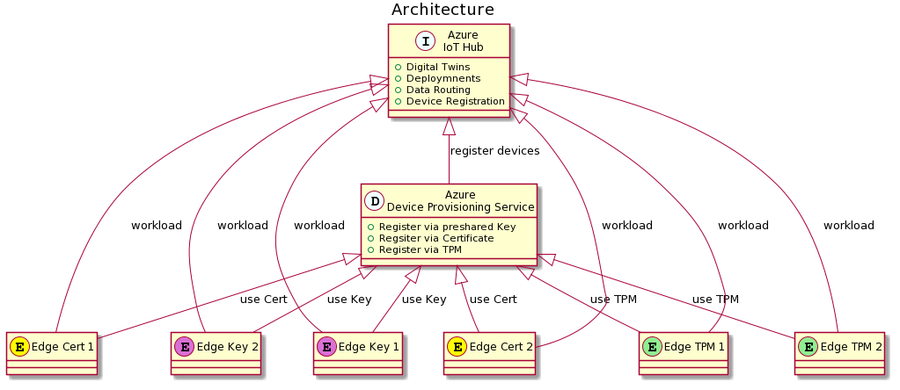

# azure-iot-edge-playground
Azure IoT Edge - Tests and provisioning

Architecture:


## Open Tasks / TODO

[] Install and Configure Squid and proxy settings on the Edge 2+4


# Prerequisites
To install this Lab, you need to fulfill some requirements.

*This Repo was developed to be used on a Ubuntu 18.04 LTS*
It should work also on other linux systems, but because of Paths i guess not under Windows.

## Requirements

* VirtualBox 5 (6 is not well supported by vagrant yet)
* Vagrant
* Azure CLI  https://docs.microsoft.com/en-us/cli/azure/?view=azure-cli-latest
* Terraform  https://learn.hashicorp.com/terraform/azure/install_az
* Azure CLI - IOT Extensions (for DPS Enrollment groups)


[source,bash]
----
az extension add --name azure-iot
----

## Authentication

Use 'az login' to connect to your Azure environment or use https://shell.azure.com which already contains az and terraform.

### Create a Service Principal

So we have first to cerate an Service Principle Account.
If something is unclear follow https://docs.microsoft.com/en-us/cli/azure/create-an-azure-service-principal-azure-cli?view=azure-cli-latest= 

[source,bash]
----
az ad sp create-for-rbac --name TerraformDeploy - o json
----

Note the output PWD and AppID

Now make sure that these account has the correct rights (contributor)

[source,bash]
----
az role assignment list --assignee APP_ID
az role assignment create --assignee APP_ID --role Contributor
----


### Using the Credentials
Export the credentials into an environment variable or add them in the header of our terraform - script (not suggested!).

.credentials.sh
[source,bash]
----
export ARM_CLIENT_ID="00000000-0000-0000-0000-000000000000"
export ARM_CLIENT_SECRET="00000000-0000-0000-0000-000000000000"
export ARM_SUBSCRIPTION_ID="00000000-0000-0000-0000-000000000000"
export ARM_TENANT_ID="00000000-0000-0000-0000-000000000000"
----

### a little Helper
There is a maintained file which can be used for dev environments. It's called "credentials-template.sh".
Usually i create a copy of "credentials-template.sh" and name it "credentials-apply.sh". This file is ignored by git and will never checked in. 
Then i can add my credentials into "credentials-apply.sh" and execute ```source credentials-apply.sh``` once, before doing anything with terraform.
That prevents on development systems that the credentials are shown in the bash history and that they are mixed up for different projects because of global environment variables. 

## Create your Playground

The Playground is based on an Azure Cloud Part, the IoT central services and a few Edge Nodes which are running locally on your Virtual Box.
The local VMs consuming 3 GB of RAM together.

In addition there are certificates required.
We will generate the Certs based on the scripts given from Microsoft for testing purposes.
Be aware that this way is not usable for production deployments. See https://github.com/Azure/iotedge/tree/master/tools/CACertificates

Local Edge 1+2 will be connected to the Azure IoT Hub via generated shared Key and Key derivation.
Edge 3+4 will use the certificates. If you change the Names of Edge 3+4 you need to change also teh certs.

Be aware that these Certs are valid only for 30 days.

You can do an "all in one" start by executing ```run-playground.sh```

### Starting on Azure

[source,bash]
----
terraform init  # download all required modules
terraform plan  # check credentials and configuration
terraform apply # install or upgrade solution
# or - terrafrom apply --auto-approve
----

### Starting on Virtualbox

Note: The first start can take up to 40 Minutes because multiple GB of Data and installation sources will be downloaded from the Internet.

[source,bash]
----
vagrant up
----


## Notes

### DPS symmetric key provisioning configuration
provisioning:
  source: "dps"
  global_endpoint: "https://global.azure-devices-provisioning.net"
  scope_id: "0ne0016203B"
  attestation:
    method: "symmetric_key"
    registration_id: "iot-edge-1-reg"
    #must be a derived key including registration id
    symmetric_key: "OcNkknqz7z06jkJDHsnnp6aFOBEkYCWepppbtfOKmJw="


